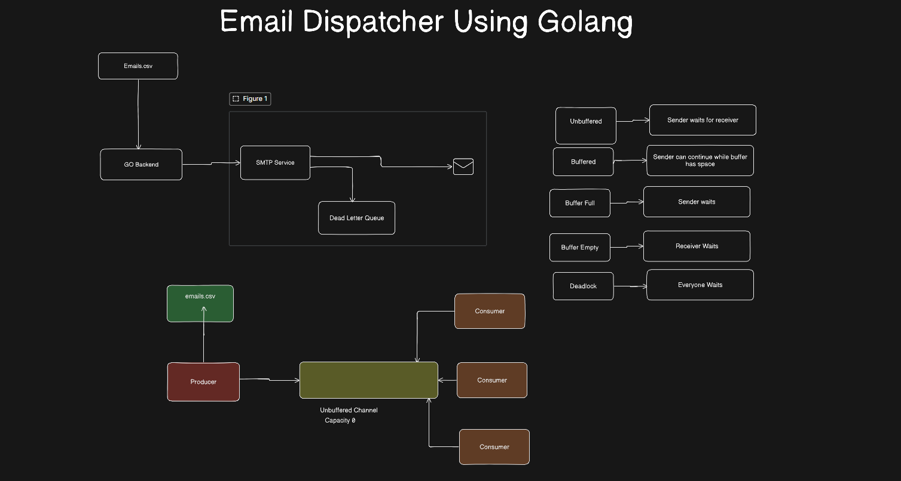

# 📨 High-Throughput Concurrent Email Dispatcher

A high-performance, concurrent email dispatching engine written in Go. Built using Go's native CSP (Communicating Sequential Processes) concurrency primitives (Goroutines, Channels, and WaitGroups), this service reads recipient lists, dynamically compiles responsive HTML email templates, dispatches messages concurrently across a worker pool, and routes failures to a dedicated **Dead Letter Queue (DLQ)**.

---

## 🏗️ Architecture



### Architectural Flow & Concurrency Mechanics

The system is structured as an asynchronous producer-consumer pipeline:

```
[ emails.csv ]
      │
      ▼
┌──────────────┐
│   Producer   │  Reads records from CSV source
└──────┬───────┘
       │  Sends Recipient structs
       ▼
┌────────────────────────┐
│   Unbuffered Channel   │  Capacity: 0 (Direct synchronization between Producer & Consumers)
└──────┬─────────────────┘
       ├───────────────────┬───────────────────┐
       ▼                   ▼                   ▼
┌──────────────┐    ┌──────────────┐    ┌──────────────┐
│  Consumer 1  │    │  Consumer 2  │    │  Consumer 3  │   Concurrent Worker Pool
└──────┬───────┘    └──────┬───────┘    └──────┬───────┘
       │                   │                   │
       └───────────────────┼───────────────────┘
                           │
            ┌──────────────┴──────────────┐
            ▼                             ▼
    [ Success Path ]              [ Failure Path ]
            │                             │
    ┌───────────────┐             ┌───────────────┐
    │  SMTP Server  │             │  Dead Letter  │
    │   (Mailpit)   │             │  Queue (DLQ)  │
    └───────────────┘             └───────┬───────┘
                                          │
                                          ▼
                                  failed_emails.csv
```

### Go Channel Mechanics Referenced in Diagram
* **Unbuffered Channel:** Capacity of 0. The sender (Producer) blocks until a receiver (Consumer worker) is ready to take the item.
* **Buffered Channel:** Allows senders to continue without waiting as long as buffer capacity is available.
* **Buffer Full:** Senders wait until consumers read and free space in the buffer.
* **Buffer Empty:** Consumers wait until the producer injects new jobs into the channel.
* **Deadlock Protection:** Synchronized termination using `sync.WaitGroup` and explicit channel closures (`close(recipientChan)`, `close(dlqChan)`) guarantees all routines exit cleanly.

---

## 🌟 Key Capabilities

* **High-Throughput Concurrency:** Utilizes a scalable worker pool pattern powered by lightweight Go goroutines.
* **Zero Data Loss Dead Letter Queue (DLQ):** Captures failed dispatches (template rendering errors or SMTP rejections) with complete context (recipient, reason, raw error, and timestamp) in `failed_emails.csv`.
* **Dynamic HTML & MIME Templating:** Parses rich, responsive HTML emails with RFC 5322 compliant headers (`From`, `To`, `Subject`, `MIME-Version`, `Content-Type`).
* **Resource Efficient:** Minimal memory footprint (less than 20MB under load), making it optimal as a companion microservice for heavier web stacks (Laravel, Django, Node.js).
* **Graceful Lifecycle Management:** Uses `sync.WaitGroup` barriers to ensure all in-flight emails are transmitted and all DLQ records are flushed to disk before application exit.

---

## ⚡ Feature Overview

| Feature | Description | Status |
| :--- | :--- | :--- |
| **Worker Pool** | Configurable concurrent worker count distributing emails fairly across workers | ✅ Implemented |
| **Streaming Producer** | Reads records sequentially without loading entire datasets into memory | ✅ Implemented |
| **Dead Letter Queue (DLQ)** | Dedicated background logger that persists failed jobs for replayability | ✅ Implemented |
| **Local SMTP Sandbox** | Pre-configured Docker Mailpit support for testing delivery without spamming real inboxes | ✅ Implemented |
| **Dynamic Templates** | Go `html/template` engine with personalized recipient placeholders | ✅ Implemented |
| **Rate Limiter / Throttling** | Artificial pacing to respect SMTP provider rate limits and quotas | ✅ Implemented |

---

## 🔒 Security Architecture

* **No Credential Exposure:** Decoupled SMTP configuration; credentials and connection parameters can be injected via environment variables or secret managers.
* **Injection-Safe Templating:** Leverages Go's `html/template` context-aware auto-escaping to mitigate XSS and injection vulnerabilities in email bodies.
* **RFC Compliant Headers:** Strict formatting prevents header injection attacks (CRLF injection) in outbound emails.
* **Secure Error Redaction:** Sensitive operational details are isolated within localized DLQ logs without leaking to external callers.

---

## 🖥️ Platform & Environment Support

* **Operating Systems:**
  * Windows 10 / 11 (PowerShell & Command Prompt)
  * Linux (Ubuntu, Debian, Alpine, RHEL, CentOS)
  * macOS (Apple Silicon & Intel)
* **Runtimes & Dependencies:**
  * **Go:** `1.21+`
  * **Docker:** Recommended for running local SMTP testing sandboxes ([Mailpit](https://github.com/axllent/mailpit)).
* **Integrations:**
  * Seamlessly pairs with web frameworks like **Laravel (PHP)**, **React**, **Next.js**, or **Python** via Redis queues, database polling, or HTTP REST APIs.

---

## 🚀 Getting Started

### 1. Prerequisites
* Install [Go](https://go.dev/dl/) (1.21+)
* Install [Docker](https://www.docker.com/) (for local SMTP Mailpit testing)

### 2. Start Local SMTP Server (Mailpit)
Run Mailpit in Docker to safely preview and inspect sent emails:

```powershell
docker run -d --restart unless-stopped --name mailpit -p 8025:8025 -p 1025:1025 axllent/mailpit
```
* **SMTP Server:** `localhost:1025`
* **Web UI (Inbox Viewer):** [http://localhost:8025](http://localhost:8025)

### 3. Run the Dispatcher
Run all package files in the current directory:

```bash
go run .
```

---

## 🗺️ Roadmap

- [x] Concurrent worker pool implementation
- [x] Unbuffered channel producer-consumer pipeline
- [x] Responsive HTML welcome template
- [x] Dead Letter Queue (DLQ) file persistence
- [ ] **Multi-Campaign Engine:** Dynamic campaign selector supporting multiple distinct templates and recipient filters
- [ ] **Redis Queue Adapter:** Direct ingestion from Laravel / Node.js via Redis Lists or Streams
- [ ] **REST API Server:** HTTP endpoints (`POST /dispatch`) to trigger campaigns on demand
- [ ] **Exponential Backoff Retries:** Auto-retry temporary SMTP network hiccups before routing to DLQ
- [ ] **Prometheus Metrics:** Export real-time metrics for delivery rate, worker utilization, and latency

---

## 📊 Project Status

* **Current Version:** `v0.2.0-alpha`
* **Build Status:** Passing
* **Active Maintainer:** [@ratuhin1122](https://github.com/ratuhin1122)
* **License:** MIT License
